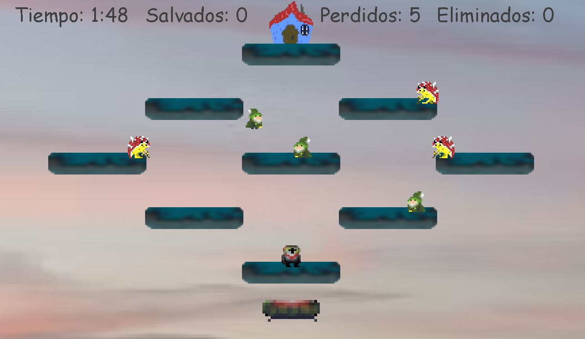

# Al rescate de los gnomos

El objetivo de este sencillo juego es rescatar a los gnomos antes de que sean eliminados por las venenosas tortugas, o caigan al vacio.

El jugador controla a un caballero medieval llamado Pep, que puede moverse libremente por las islas flotantes, y que cuenta con la capacidad de arrojar pequeñas bolas de fuego para acabar con las tortugas.

Tambien se cuenta con una nave de combate, en la cual Pep y los gnomos pueden caminar.

